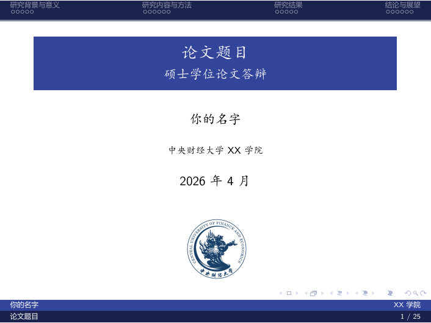

# CUFE Beamer Thesis Defense Template

一个非官方的中央财经大学毕业论文答辩 Beamer 模板，适合本科、硕士或课程展示场景。模板保留了经典 Beamer `smoothbars` 顶部导航、底部作者/学院/页码栏，以及中央财经大学蓝色主题风格。

> 说明：本项目为非官方模板，不代表中央财经大学或任何学院的正式规范。正式提交或答辩前，请以学院/导师/教务部门发布的最新要求为准。

## 预览



更多预览图见 [`preview/`](preview/)；已编译示例见 [`slide_defense_blue.pdf`](slide_defense_blue.pdf)。

## 快速开始

### 1. 安装 LaTeX 环境

推荐使用以下任一发行版：

- TeX Live 2023 或更新版本
- MiKTeX
- Overleaf

中文支持依赖 XeLaTeX，请不要使用 pdfLaTeX 编译。

### 2. 编译模板

在项目根目录运行：

```bash
latexmk -xelatex slide_defense_blue.tex
```

或手动运行：

```bash
xelatex slide_defense_blue.tex
```

如目录、引用或页码未更新，重复编译一次即可。

### 3. 修改个人信息

打开 [`slide_defense_blue.tex`](slide_defense_blue.tex)，修改开头的信息：

```tex
\author{你的名字}
\title{论文题目}
\subtitle{本科毕业论文答辩}
\institute[XX学院]{中央财经大学XX学院}
\date{2026年4月}
```

方括号中的短标题/短学院名会显示在底部栏或导航栏中。

## 文件结构

```text
.
├── slide_defense_blue.tex     # 蓝色主题答辩示例
├── cufe.sty                   # 蓝色 Beamer 主题样式
├── cufe_red.sty               # 红色 Beamer 主题样式
├── ref.bib                    # 参考文献示例
├── pic/                       # 校徽和示例图片资源
├── preview/                   # README 预览图
└── slide_defense_blue.pdf     # 已编译示例 PDF
```

## 主题切换

默认使用蓝色主题：

```tex
\usepackage{cufe}
```

如果希望使用红色主题，可改为：

```tex
\usepackage{cufe_red}
```

并将封面 logo 图片替换为红色版本，例如：

```tex
\includegraphics[width=0.2\linewidth]{pic/logo_red.eps}
```

## 自定义内容

### 替换章节

模板内已给出一套答辩汇报结构：

- 研究背景与问题提出
- 研究内容与方法
- 研究结果与解释分析
- 结论、不足与展望

你可以直接替换每一页的提示文字、表格、公式和图形。

### 插入图片

将图片放入 `pic/` 目录，然后在正文中使用：

```tex
\includegraphics[width=0.8\linewidth]{pic/your-figure.pdf}
```

推荐使用 PDF、EPS、SVG 转 PDF 等矢量格式；位图建议使用高清 PNG。

### 参考文献

如果需要参考文献页，可以在正文中添加：

```tex
\section{参考文献}

\begin{frame}[allowframebreaks]{参考文献}
  \bibliography{ref}
  \bibliographystyle{alpha}
\end{frame}
```

并在 `ref.bib` 中维护 BibTeX 条目。

## 上传 GitHub 前建议

建议保留：

- `slide_defense_blue.tex`
- `cufe.sty`
- `cufe_red.sty`
- `ref.bib`
- `README.md`
- `LICENSE`
- `NOTICE.md`
- `preview/`
- `pic/` 中你有权公开分发的图片

建议不要提交 LaTeX 编译中间文件，例如：

- `*.aux`
- `*.log`
- `*.nav`
- `*.out`
- `*.snm`
- `*.toc`
- `*.xdv`
- `*.synctex.gz`

本仓库已提供 `.gitignore` 用于忽略这些文件。

## 常见问题

### 中文乱码怎么办？

请确认源文件保存为 UTF-8，并使用 XeLaTeX 编译。

### Overleaf 如何使用？

将整个文件夹压缩后上传到 Overleaf，在菜单中把 Compiler 设置为 `XeLaTeX`，主文件选择 `slide_defense_blue.tex`。

### 为什么页码或目录不对？

Beamer 需要多次编译才能更新目录、页码和引用。使用 `latexmk -xelatex` 会自动处理。

### 可以改成其他学校使用吗？

可以。请替换 `\institute`、标题页校徽和相关学校名称；如果公开发布，请确保图片、校徽和校名使用符合对应学校的规定。

## 许可证与来源

除另有说明外，本项目中的模板源码和示例内容按 [Creative Commons Attribution 4.0 International License](https://creativecommons.org/licenses/by/4.0/) 发布。请在二次分发或改编时保留适当署名。

本模板基于本地已有的 CUFE Beamer 样式整理而来，并参考/改编自：

- [THU Beamer Theme](https://www.overleaf.com/latex/templates/thu-beamer-theme/vwnqmzndvwyb)，Overleaf 页面标注 License 为 CC BY 4.0。
- 本地历史版本中引用的 CUFE 课程论文 LaTeX 模板来源说明。

校徽、学校标识和其他第三方素材可能不属于上述开源许可范围。公开发布前，请阅读 [`NOTICE.md`](NOTICE.md)。
